  
  <!-- 引入刚才创建的动画 SVG -->
  

    

  <!-- 下面可以加一些炫酷的徽章，保持蓝绿色调 -->
  
  

### 🌱 I’m currently learning ...
> 学习中................
> 

<!-- 贪吃蛇动画（GitHub 会自动生成） -->
<!-- 注意：这个需要配置 GitHub Action 才能生效，如果你没配置过，先只用上面的 SVG -->
<!--  -->

<!-- 动态打字效果 -->

